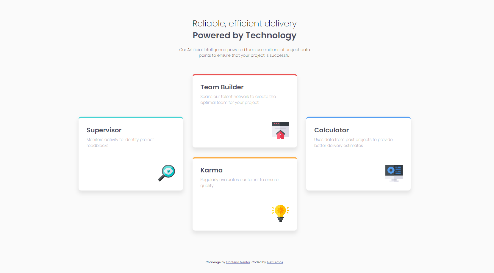

# Frontend Mentor - Four card feature section solution

This is a solution to the [Four card feature section challenge on Frontend Mentor](https://www.frontendmentor.io/challenges/four-card-feature-section-weK1eFYK). Frontend Mentor challenges help you improve your coding skills by building realistic projects. 

## Table of contents

- [Overview](#overview)
  - [The challenge](#the-challenge)
  - [Screenshot](#screenshot)
  - [Links](#links)
- [My process](#my-process)
  - [Built with](#built-with)
  - [What I learned](#what-i-learned)
- [Author](#author)

## Overview

### The challenge

Users should be able to:

- View the optimal layout for the site depending on their device's screen size

### Screenshot

### Links

- Solution URL: [frontendmentor.io/solutions](https://www.frontendmentor.io/solutions/four-card-feature-section-h6GG2Rr80)
- Live Site URL: [alex-lemos.github.io/four-card-feature-section-master](https://alex-lemos.github.io/four-card-feature-section-master/)

## My process

I have to organize an entire HTML structure, with main, header and section.

To position the cards well, I left two outside a div and two inside a div, where I used flexbox to put the ones inside a div, one on top of the other, which was undoubtedly my biggest challenge and the spacing made with margin.

### Built with

- Semantic HTML5 markup
- CSS custom properties
- Flexbox

### What I learned

I learned to use fexxbox properties in a more efficient way and to better organize my HTML code and, besides, I managed to keep my CSS code organized, using BEM.

## Author

- GitHub - [Alex Lemos](https://github.com/alex-lemos)
- Frontend Mentor - [@alex-lemos](https://www.frontendmentor.io/profile/alex-lemos)
